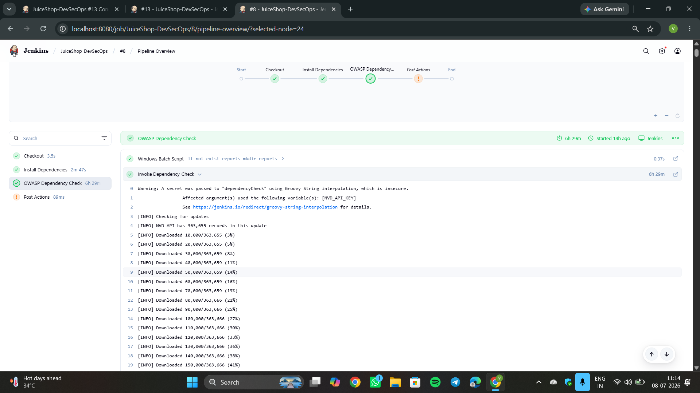
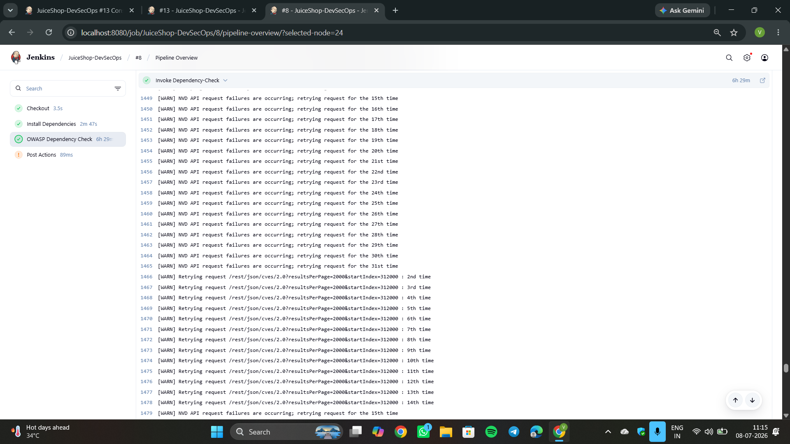
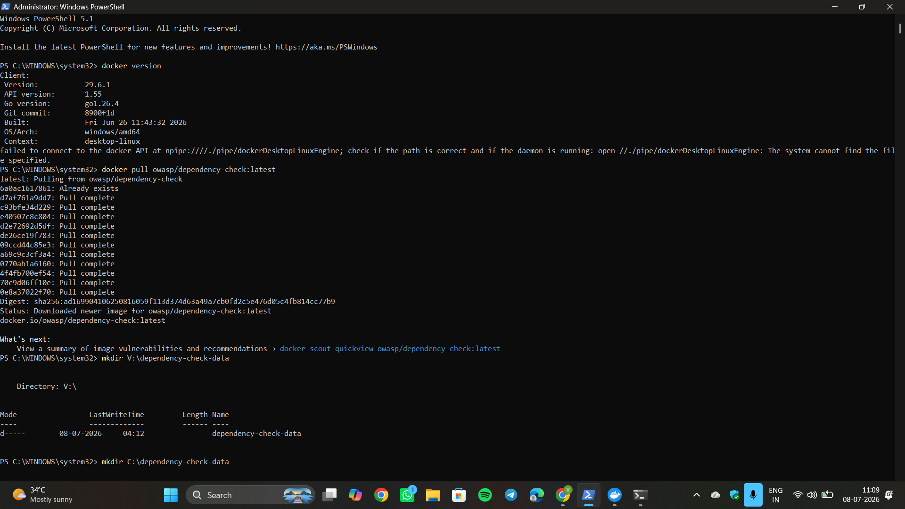
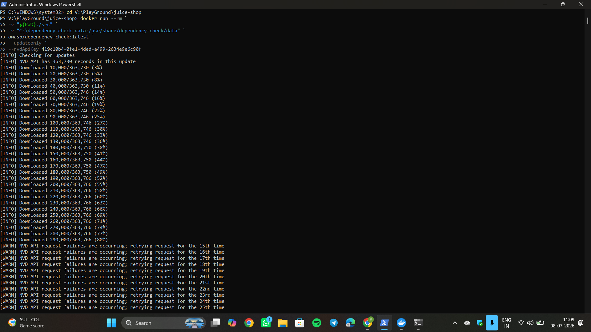
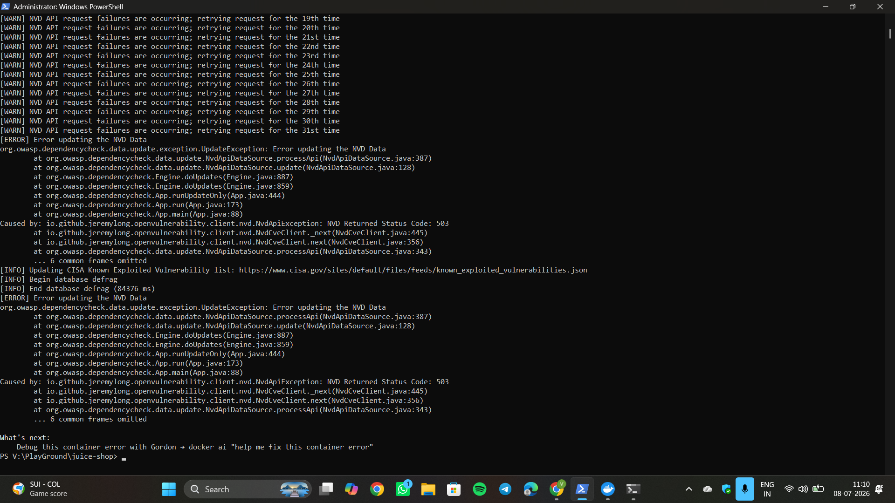
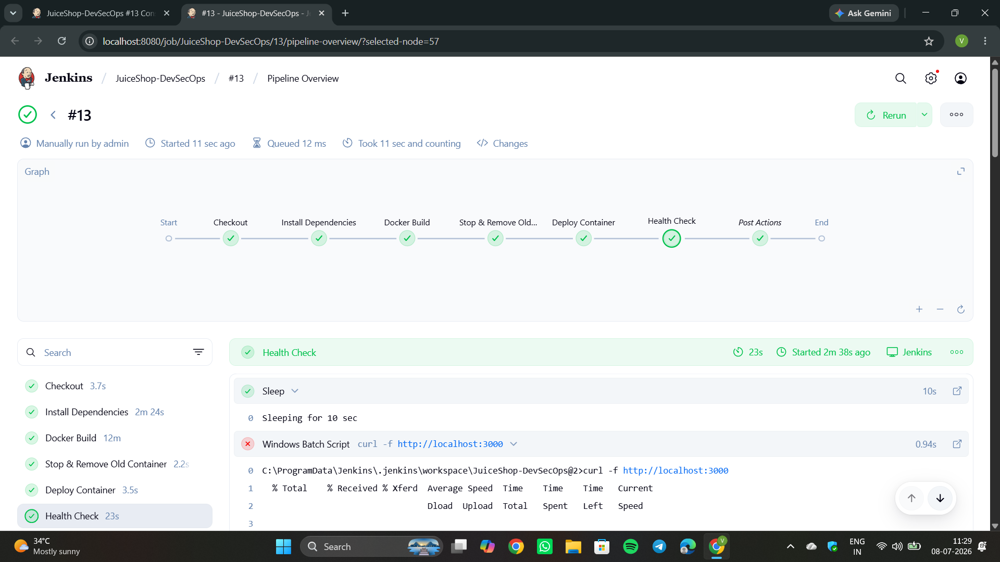
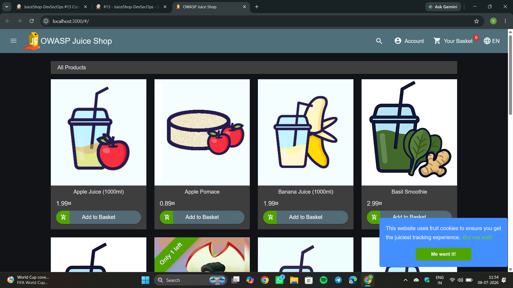

# Juice Shop — DevSecOps Assessment

> **OWASP Juice Shop** is the world's most widely used intentionally insecure web application, maintained by OWASP. Every vulnerability it contains is deliberate — SQL Injection, XSS, Broken Authentication, Insecure Dependencies — all planted on purpose for security training. This assessment builds a CI/CD pipeline around it to demonstrate DevSecOps practices: automated build, containerised deployment, and dependency vulnerability scanning.

---

## Table of Contents

1. [Objectives](#objectives)
2. [Assessment Summary](#assessment-summary)
3. [Tech Stack](#tech-stack)
4. [Repository Structure](#repository-structure)
5. [Jenkins Pipeline Stages](#jenkins-pipeline-stages)
6. [OWASP Dependency-Check Integration](#owasp-dependency-check-integration)
7. [NVD API Key Configuration](#nvd-api-key-configuration)
8. [Troubleshooting & Investigation](#troubleshooting--investigation)
9. [Results](#results)
10. [How to Run](#how-to-run)
11. [Future Improvements](#future-improvements)

---

## Objectives

This assessment implements a complete DevSecOps pipeline for OWASP Juice Shop with the following goals:

- **Build** the application from source code using an automated Jenkins pipeline
- **Deploy** the application as a Docker container on localhost
- **Scan** project dependencies for known CVEs using OWASP Dependency-Check
- **Report** vulnerability findings as a published Jenkins artifact
- **Document** the full implementation, including troubleshooting and decisions made

---

## Assessment Summary

This assessment implements a complete Jenkins-based CI/CD pipeline for OWASP Juice Shop, including source code checkout, dependency installation, Docker image creation, container deployment, and automated health verification on localhost.

OWASP Dependency-Check was fully integrated into the Jenkins pipeline using the official Jenkins plugin with the NVD API key securely managed through Jenkins Credentials. During testing, the Dependency-Check stage executed successfully but could not complete because the initial NVD vulnerability database download repeatedly failed with HTTP 503 (Service Unavailable) responses from the NVD API.

To verify that the issue was not related to the pipeline configuration, the same database bootstrap was also tested using the official OWASP Dependency-Check Docker image with a persistent mounted data directory. The Docker-based approach produced the same HTTP 503 error, confirming that the issue originated from the external NVD service rather than the Jenkins pipeline or Dependency-Check configuration.

All implementation steps, troubleshooting activities, console outputs, and deployment evidence have been documented in this repository.

---

## Tech Stack

| Tool | Role |
|---|---|
| **Jenkins** | CI/CD orchestration (Pipeline as Code via Jenkinsfile) |
| **Docker** | Application containerisation and deployment |
| **Node.js 24** | Application runtime (required: Node 22–26) |
| **npm** | Dependency management and build lifecycle |
| **OWASP Dependency-Check** | Software Composition Analysis (SCA) — CVE detection |
| **NVD (National Vulnerability Database)** | CVE data source consumed by Dependency-Check |
| **GitHub** | Source control and remote repository |
| **Angular 21** | Frontend framework (built as part of `npm install`) |

---

## Repository Structure

```
juice-shop-devsecops-assessment/
│
├── Jenkinsfile                  ← Pipeline definition (all stages)
├── Dockerfile                   ← Multi-stage Docker build (node:24 → distroless)
├── package.json                 ← Backend dependencies and npm scripts
├── frontend/
│   └── package.json             ← Frontend (Angular) dependencies
├── screenshots/                 ← Evidence of pipeline execution and troubleshooting
├── app.ts                       ← Application entry point
├── server.ts                    ← Express server setup
├── routes/                      ← REST API route handlers
├── models/                      ← Sequelize ORM models (SQLite)
├── config/
│   └── default.yml              ← Default application configuration
└── .github/
    └── workflows/               ← Original GitHub Actions CI reference
```

> **Note**: The project has two `package.json` files — one at the root (backend) and one inside `frontend/` (Angular). Running `npm install` at the root automatically installs and builds both via the `postinstall` lifecycle hook.

---

## Jenkins Pipeline Stages

The pipeline is defined in [`Jenkinsfile`](./Jenkinsfile) at the repository root and uses **Pipeline script from SCM** in Jenkins. `skipDefaultCheckout(true)` is set so the automatic Jenkins checkout is suppressed — the explicit `Checkout` stage handles it instead, making it visible in the Stage View.

```
Checkout → Install Dependencies → OWASP Dependency Check → Docker Build → Stop & Remove Old Container → Deploy Container → Health Check
```

### Stage 1 — Checkout

Explicitly clones the repository into the Jenkins workspace using `checkout scm`. This makes the checkout visible as a named stage rather than a hidden pre-pipeline operation.

### Stage 2 — Install Dependencies

Verifies the Node.js and npm versions on the agent first, then runs `npm install`. The project's postinstall lifecycle hook automatically installs frontend dependencies and builds both the Angular frontend and the TypeScript backend. This produces the `node_modules/` directory used by OWASP Dependency-Check in the next stage.

```groovy
bat 'node --version'
bat 'npm --version'
bat 'npm install'
```

> Verifying versions upfront fails fast if the agent has the wrong Node version (app requires Node 22–26), rather than producing a cryptic failure deep in `npm install`.

### Stage 3 — OWASP Dependency Check

Scans project dependencies against the NVD to identify known CVEs. The stage is fully implemented in the Jenkins pipeline and executes during pipeline runs. However, the scan cannot complete because the initial NVD vulnerability database download repeatedly fails due to HTTP 503 (Service Unavailable) responses from the NVD API. The full implementation, investigation steps, and supporting evidence are documented in the [OWASP Dependency-Check Integration](#owasp-dependency-check-integration) and [Troubleshooting & Investigation](#troubleshooting--investigation) sections below.

### Stage 4 — Docker Build

Builds the Docker image using the existing project `Dockerfile`, which uses a multi-stage build: `node:24` as the build stage and `gcr.io/distroless/nodejs24-debian13` as the lean runtime. The image is tagged with `juice-shop:<BUILD_NUMBER>` for traceability across builds.

```groovy
bat "docker build -t juice-shop:${env.BUILD_NUMBER} ."
```

### Stage 5 — Stop & Remove Old Container

Cleans up any previously running container before deploying a new one. Uses `returnStatus: true` so the stage never fails even if no container exists — this makes the pipeline **idempotent** across repeated runs.

```groovy
bat(returnStatus: true, script: "docker stop juice-shop-dev")
bat(returnStatus: true, script: "docker rm juice-shop-dev")
```

### Stage 6 — Deploy Container

Runs the newly built image as a detached container, mapping port 3000.

```groovy
bat "docker run -d -p 3000:3000 --name juice-shop-dev juice-shop:${env.BUILD_NUMBER}"
```

### Stage 7 — Health Check

Polls the application with `curl` until it responds successfully or exhausts all retries. Retries up to 10 times with a 10-second pause between attempts, giving the application up to 100 seconds to become available before the stage fails.

```groovy
retry(10) {
    sleep(time: 10, unit: 'SECONDS')
    bat "curl -f http://localhost:3000"
}
```

### Post — Publish Report

The `post { always { } }` block runs regardless of which stage succeeded or failed. This ensures the Dependency-Check report is always published in Jenkins, even if a later stage (Docker Build, Deploy) fails — because the report is the primary security deliverable of the pipeline.

```groovy
post {
    always {
        dependencyCheckPublisher pattern: 'reports/dependency-check-report.xml'
    }
}
```

---

## OWASP Dependency-Check Integration

The Jenkins pipeline integrates **OWASP Dependency-Check** using the official Jenkins plugin to perform Software Composition Analysis (SCA) on project dependencies. The Dependency-Check stage scans `node_modules/` and `package-lock.json` against the NVD to identify CVEs in all direct and transitive dependencies.

> **Important context**: OWASP Juice Shop intentionally includes vulnerable dependencies (e.g. `jsonwebtoken@0.4.0`, `sanitize-html@1.4.2`, `express-jwt@0.1.3`) as part of its security training design. The expected outcome of the scan is a large number of CVE findings — this is by design. The pipeline uses `--failOnCVSS 11` so the build is never blocked by these findings. The goal is detection and reporting, not build gating.

### Pipeline Stage (Jenkinsfile)

The stage is fully implemented and active. The NVD API key is passed using `withEnv` to avoid Groovy string interpolation of the secret, following Jenkins security best practices. The `%DC_API_KEY%` syntax is Windows batch variable expansion, resolved at runtime by the shell rather than by Groovy.

```groovy
stage('OWASP Dependency Check') {
    steps {
        bat 'if not exist reports mkdir reports'
        withEnv(["DC_API_KEY=${NVD_API_KEY}"]) {
            dependencyCheck(
                odcInstallation: 'OWASP-DC',
                additionalArguments: '--scan ./ --format HTML --format XML --out reports/ --prettyPrint --failOnCVSS 11 --nvdApiKey %DC_API_KEY%'
            )
        }
    }
}
```

The stage executes during every pipeline run. The scan cannot complete because the NVD API returns HTTP 503 responses during the initial vulnerability database bootstrap, as described in the [Troubleshooting & Investigation](#troubleshooting--investigation) section.

---

## NVD API Key Configuration

Without an NVD API key, the NVD imposes heavy rate limits on database downloads, making the initial bootstrap take many hours. An API key was obtained from the [NVD API portal](https://nvd.nist.gov/developers/request-an-api-key) and configured as follows:

**Security practice applied**: The key is stored as a **Jenkins Secret Text Credential** (Credential ID: `NVD_API_KEY`) — never hardcoded in the `Jenkinsfile` or committed to source control. Jenkins injects and masks it at runtime.

```groovy
environment {
    NVD_API_KEY = credentials('NVD_API_KEY')   // injected + masked in logs
}
```

The key is injected into the scan via `withEnv`, which passes it as an OS environment variable rather than interpolating it directly into the Groovy string. This avoids the Jenkins secret interpolation warning and keeps the secret masked in console logs:

```groovy
withEnv(["DC_API_KEY=${NVD_API_KEY}"]) {
    dependencyCheck(
        odcInstallation: 'OWASP-DC',
        additionalArguments: '... --nvdApiKey %DC_API_KEY%'  // Windows batch syntax
    )
}
```

This reflects standard production CI/CD practice: secrets are centrally managed by the CI system and securely consumed by pipelines without ever appearing in source code or logs.

---

## Troubleshooting & Investigation

### Problem: NVD Database Initial Download Failure

During the first execution of the Dependency-Check stage, the NVD API must download the complete vulnerability dataset (~363,000+ CVE records) before any scan can run. The download repeatedly failed due to **HTTP 503 (Service Unavailable)** responses from the NVD API, typically after reaching approximately **80% of the dataset**.

This is an **external service availability issue**, not a problem with the pipeline configuration.

### Approaches Evaluated

All three approaches below were tested independently. Because all of them consume the same NVD API endpoint, they all exhibited identical behaviour when the NVD service became unavailable.

---

#### Approach 1 — Jenkins Dependency-Check Plugin

Configured the official **OWASP Dependency-Check Jenkins Plugin** with a managed tool installation named `OWASP-DC`. The plugin was invoked directly from the Jenkinsfile using the `dependencyCheck` step with the NVD API key injected from Jenkins Credentials.

**Outcome**: The plugin initiated the NVD database download successfully but received HTTP 503 responses from the NVD API before the download completed.



*The Jenkins plugin begins the NVD database synchronisation.*



*HTTP 503 responses from the NVD API halt the download before it completes.*

---

#### Approach 2 — OWASP Dependency-Check Docker Image

Tested the official `owasp/dependency-check` Docker image with a **persistent mounted data directory** (`C:\dependency-check-data`) to pre-populate the vulnerability database entirely outside Jenkins. The intent was to get the DB bootstrapped independently and then have Jenkins reuse it.

**Outcome**: The Docker image successfully initialised and began downloading the NVD dataset, reaching approximately 80% before encountering the same HTTP 503 errors from the NVD API.



*The `owasp/dependency-check` Docker image begins NVD database initialisation.*



*Download progresses to ~80% before the NVD API becomes unavailable.*



*HTTP 503 error from the NVD API terminates the download. All three methods share the same NVD backend and are equally affected.*

---

### Root Cause

All three approaches—the Jenkins plugin, the Dependency-Check CLI, and the official Docker image—ultimately consume the same NVD REST API to download vulnerability data.

Since every approach produced the same HTTP 503 response during the initial database bootstrap, changing the execution method did not eliminate the issue. This confirmed that the failure originated from the external NVD service rather than from the Jenkins pipeline, Dependency-Check configuration, or Docker environment.

> The pipeline configuration and Dependency-Check integration are complete and functional. Successful execution of the initial vulnerability scan depends on the availability of the NVD API during the one-time database bootstrap.

Once the vulnerability database is successfully initialized, subsequent pipeline executions will perform only incremental updates and the Dependency-Check stage is expected to complete within a few minutes.

---

## Results

### CI/CD Pipeline

The Jenkins pipeline successfully:

| Step | Result |
|---|---|
| Checks out source code from GitHub | ✅ |
| Verifies Node.js 24 on the agent | ✅ |
| Installs all dependencies and builds the application | ✅ |
| Builds a Docker image tagged with the build number | ✅ |
| Stops and removes the previous container (idempotent) | ✅ |
| Deploys the new container on port 3000 | ✅ |
| Health-checks the live application with retry logic | ✅ |
| OWASP Dependency-Check integration | ✅ Implemented |
| Dependency scan execution | ⚠️ Blocked by NVD API (HTTP 503 during initial database download) |

### Application Deployment

The application is successfully deployed as a Docker container and is accessible on **http://localhost:3000** after every successful Jenkins pipeline execution. The Health Check stage verifies that the application is responding before the pipeline completes.

#### Jenkins Pipeline Completed Successfully



*All active pipeline stages complete successfully. The application is built, deployed, and verified through an automated health check.*

#### OWASP Juice Shop Running on Localhost

The successful deployment can be verified by accessing the application in a web browser at:

```text
http://localhost:3000
```



*OWASP Juice Shop successfully running on localhost after being built and deployed through the Jenkins pipeline.*

---

## How to Run

### Prerequisites

- Jenkins (running locally or via Docker)
- Docker Desktop (for Docker commands on the Jenkins agent)
- Node.js 22–26 on the Jenkins agent
- Jenkins plugins installed:
  - Git
  - Pipeline
  - OWASP Dependency-Check
  - HTML Publisher

### Jenkins Tool Configuration

In **Jenkins → Manage Jenkins → Tools → Dependency-Check installations**:
- Name: `OWASP-DC`
- ✅ Install automatically → select latest version

### Jenkins Credential Configuration

In **Jenkins → Manage Jenkins → Credentials → Global**:
- Kind: Secret Text
- ID: `NVD_API_KEY`
- Secret: *(your NVD API key from https://nvd.nist.gov/developers/request-an-api-key)*

### Pipeline Setup

1. Create a new **Pipeline** job in Jenkins
2. Under **Pipeline** → Definition: `Pipeline script from SCM`
3. SCM: Git → Repository URL: `https://github.com/Vasanth1602/juice-shop-devsecops-assessment.git`
4. Branch: `*/main`
5. Script Path: `Jenkinsfile`
6. Click **Save** → **Build Now**

### Verify the Deployment

After a successful pipeline run:
```bash
# Confirm container is running
docker ps

# Open the application
curl http://localhost:3000

# Or open in browser
http://localhost:3000
```

---

## Future Improvements

- Successfully complete the initial NVD vulnerability database bootstrap once the NVD API becomes available again so the existing Dependency-Check stage can generate HTML and XML vulnerability reports during pipeline execution
- **Cache the NVD database** using `--data` pointing to a fixed path outside the workspace (e.g. `C:\jenkins-dc-data`) so it survives workspace cleans and only incremental updates are needed on subsequent runs
- **Add npm audit** as a fast, lightweight SCA fallback that runs without an external database download
- **Add build failure thresholds** — use `--failOnCVSS 7` to fail the pipeline on HIGH/CRITICAL CVEs in a production context (currently set to 11 to always pass, appropriate for this training application)
- **Frontend dependency scan** — run a separate Dependency-Check scan against `frontend/node_modules` for complete coverage of both backend and Angular dependencies
- **Notifications** — add email or Slack notifications on pipeline failure via Jenkins `post { failure { } }` block
